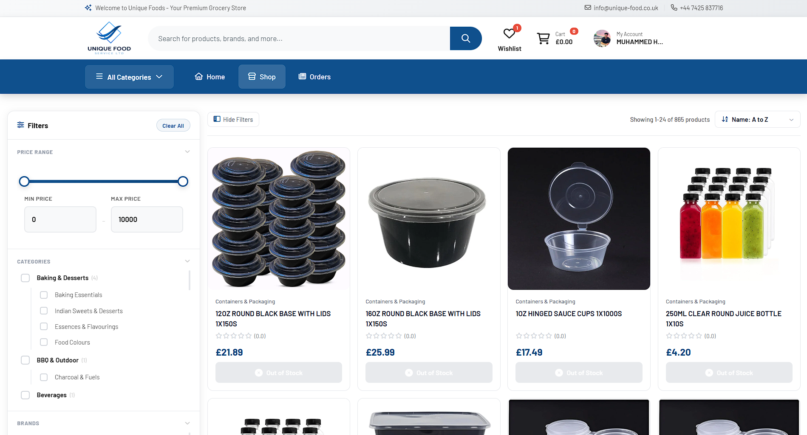
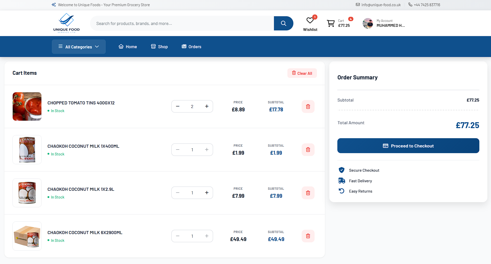
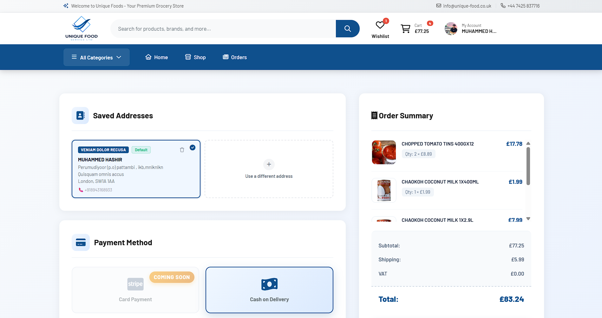
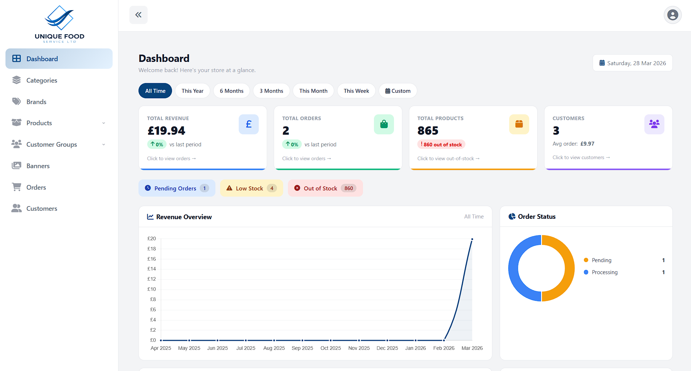
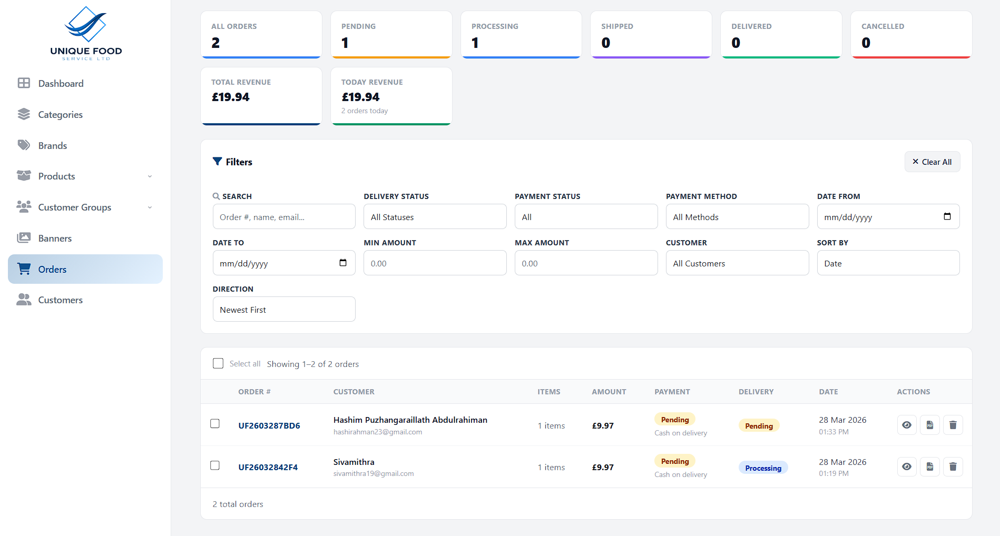
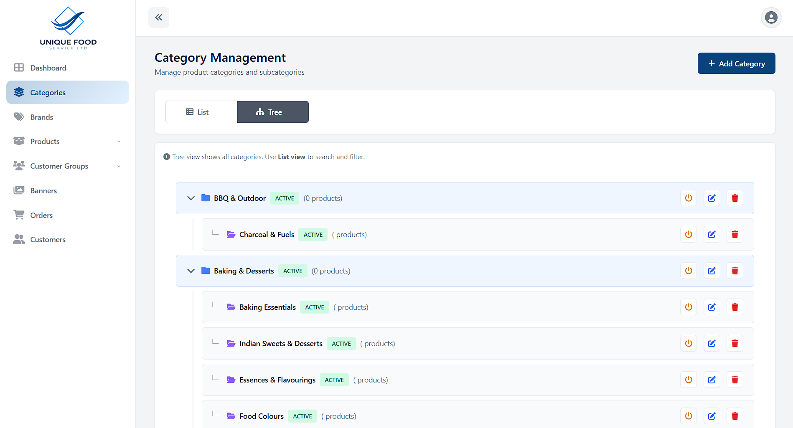
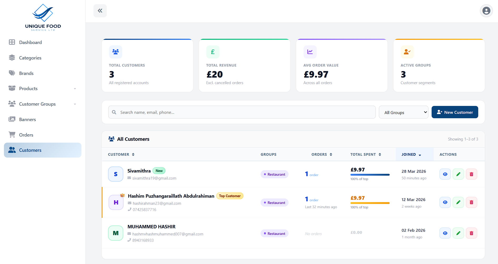

# 🛒 Unique Foods — E-Commerce Platform

A full-featured e-commerce web application built with **Laravel** for selling food products online. Unique Foods provides a seamless shopping experience for customers and a powerful admin dashboard for store management.

---

## 🚀 Tech Stack

| Layer | Technology |
|---|---|
| Backend | PHP / Laravel |
| Frontend | Blade Templates, jQuery, AJAX, Tailwind CSS |
| Database | MySQL |
| Payment | Stripe |
| Storage | AWS S3 / Local |
| Deployment | Hostinger / AWS |

---

## ✨ Features

### 🛍️ Customer-Facing

- **Product Catalog** — Browse food products with categories, filters, and search
- **Product Detail Pages** — Rich product descriptions, images, and pricing
- **Shopping Cart** — Add/remove items, update quantities with AJAX — no page reload
- **Secure Checkout** — Multi-step checkout with address, shipping, and payment
- **Stripe Payment Integration** — Secure online payments via Stripe
- **Order Tracking** — Real-time order status tracking powered by Shiprocket
- **User Authentication** — Register, login, and manage personal accounts
- **Order History** — View past orders and their statuses
- **Responsive Design** — Fully mobile-friendly UI across all screen sizes

### 🔧 Admin Dashboard

- **Product Management** — Add, edit, delete products with image uploads
- **Category Management** — Organize products into categories
- **Order Management** — View, update, and manage all customer orders
- **Shiprocket Integration** — Auto-create shipments and track deliveries
- **Customer Management** — View registered users and their order history
- **Inventory Control** — Manage stock availability per product
- **Sales Analytics** — Dashboard with order stats and revenue overview
- **Coupon / Discount Management** — Create and manage discount codes

---

## 📸 Screenshots

### Product Listing


### Shopping Cart


### Checkout Page


### Admin Dashboard


### Order Management


### Categories Mangement


### Customers Management


> 💡 **To add screenshots:** Create a `screenshots/` folder in the root of this repository and upload your image files with the matching filenames above.

---

## 📦 Integrations

### 💳 Stripe
Handles secure payment processing for all customer orders. Supports card payments with webhook-based order confirmation.

### 🚚 Shiprocket
Automates shipping logistics — creates shipment orders, generates AWB numbers, and provides live tracking for customers.

---

## ⚙️ Installation & Setup

### Prerequisites
- PHP >= 8.1
- Composer
- MySQL
- Node.js & npm

### Steps

```bash
# Clone the repository
git clone https://github.com/Hashirhash001/Uniquefoods.git
cd Uniquefoods

# Install PHP dependencies
composer install

# Install frontend dependencies
npm install && npm run build

# Copy and configure environment
cp .env.example .env
php artisan key:generate

# Configure your .env (DB, Stripe, Shiprocket, Mail credentials)

# Run migrations
php artisan migrate

# Link storage
php artisan storage:link

# Start development server
php artisan serve
```

---

## 🔑 Environment Variables

Key variables to configure in your `.env` file:

```env
APP_NAME="Unique Foods"
APP_ENV=local
APP_KEY=
APP_DEBUG=true
APP_URL=http://localhost

# Database
DB_CONNECTION=mysql
DB_HOST=127.0.0.1
DB_PORT=3306
DB_DATABASE=uniquefoods
DB_USERNAME=root
DB_PASSWORD=

# Mail
MAIL_MAILER=smtp
MAIL_HOST=your_mail_host
MAIL_PORT=587
MAIL_USERNAME=your_mail_username
MAIL_PASSWORD=your_mail_password
MAIL_ENCRYPTION=tls
MAIL_FROM_ADDRESS=noreply@uniquefoods.com
MAIL_FROM_NAME="Unique Foods"

# AWS S3 (for image storage)
AWS_ACCESS_KEY_ID=your_aws_access_key
AWS_SECRET_ACCESS_KEY=your_aws_secret_key
AWS_DEFAULT_REGION=ap-south-1
AWS_BUCKET=your_s3_bucket_name

# Stripe Payment Gateway
STRIPE_KEY=your_stripe_publishable_key
STRIPE_SECRET=your_stripe_secret_key
STRIPE_WEBHOOK_SECRET=your_stripe_webhook_secret

# Shiprocket Shipping
SHIPROCKET_EMAIL=your_shiprocket_account_email
SHIPROCKET_PASSWORD=your_shiprocket_account_password
SHIPROCKET_CHANNEL_ID=your_shiprocket_channel_id
SHIPROCKET_PICKUP_LOCATION=your_pickup_location_name
```

---

## 📁 Project Structure

```
Uniquefoods/
├── app/
│   ├── Http/Controllers/   # Admin & Frontend Controllers
│   ├── Models/             # Eloquent Models
│   └── Services/           # Stripe, Shiprocket Services
├── database/
│   └── migrations/         # Database schema
├── resources/
│   └── views/              # Blade templates (frontend + admin)
├── routes/
│   └── web.php             # Application routes
├── screenshots/            # 📸 Add your screenshots here
└── public/                 # Assets
```

---

## 📄 License

This project is proprietary software. All rights reserved.

---

> Built with ❤️ using Laravel — [Hashirhash001](https://github.com/Hashirhash001)
